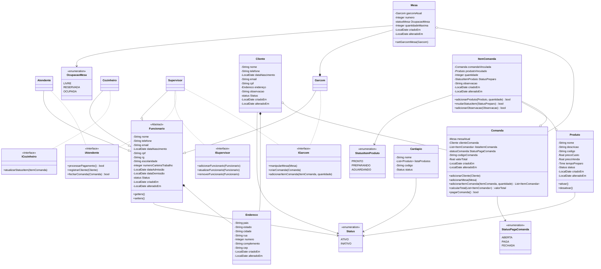

```mermaid
classDiagram
    class Funcionario{
	    <<Abstract>>
        -String nome
        -String telefone
        -String email
        -LocalDate dataNascimento
        -String cpf
        -String rg
        -String escolaridade
        -integer numeroCarteiraTrabalho
        -LocalDate dataAdmissão
        -LocalDate dataDemissão
        -status Status
        -LocalDate criadoEm
		-LocalDate alteradoEm
        +getters()
        +setters()
    }
    Funcionario --> Status
    Funcionario *-- Endereco
    class Atendente{
    }
    Atendente --|> Funcionario
    Atendente .. IAtendente
    class Garcom{
    }
    Garcom --|> Funcionario
    Garcom .. IGarcom
    class Cozinheiro{
    }
    Cozinheiro --|> Funcionario
    Cozinheiro .. ICozinheiro
    class Supervisor{
    }
    Supervisor --|> Funcionario
    Supervisor .. ISupervisor
    Supervisor .. IAtendente
    Supervisor .. IGarcom
    class Cliente {
        -String nome
        -String telefone
        -LocalDate dataNascimento
        -String email
        -String cpf
        -Endereco endereço
        -String observacao
        -status Status
        -LocalDate criadoEm
		-LocalDate alteradoEm
    }
    Cliente --> Status
    Cliente *-- Endereco
    class Endereco {
        -String pais
        -String estado
        -String cidade
        -String rua
        -Integer numero
        -String complemento
        -String cep
        -LocalDate criadoEm
		-LocalDate alteradoEm
    }
    class Mesa {
        -Garcom garcomAtual
        -Integer numero
        -statusMesa OcupacaoMesa
        -Integer quantidadeMaxima
        -LocalDate criadoEm
		-LocalDate alteradoEm
        +setGarcomMesa(Garcom)
    }
    Mesa --> OcupacaoMesa
    Mesa --* Garcom
    class Comanda {
        -Mesa mesaAtual
        -Cliente clienteComanda
        -List~ItemComanda~ listaItemComanda
        -statusComanda StatusPagaComanda
        -String codigoComanda
        -float valorTotal
        -LocalDate criadoEm
		-LocalDate alteradoEm
        +adicionarCliente(Cliente)
        +adicionarMesa(Mesa)
        +adicionarItemComanda(ItemComanda, quantidade) List~ItemComanda~
        +calcularTotal(List~ItemComanda~) valorTotal
        +pagarComanda() bool
    }
    Comanda --> StatusPagaComanda
    Mesa o-- Comanda
    Cliente o-- Comanda
    class Produto {
        -String nome
        -String descricao
        -String codigo
        -float precoCusto
        -float precoVenda
        -Time tempoPreparo
        -Status status
        -LocalDate criadoEm
		-LocalDate alteradoEm
        +ativar()
        +desativar()
    }
    Produto --> Status
    class ItemComanda {
        -Comanda comandaVinculada
        -Produto produtoVinculado
        -Integer quantidade
        -StatusItemProduto StatusPreparo
        -String observacao
        -LocalDate criadoEm
		-LocalDate alteradoEm
        +adicionarProduto(Produto, quantidade) bool
        +mudarStatusItem(StatusPreparo) bool
        +adicionarObservacao(Observacao) bool
    }
    ItemComanda --> StatusItemProduto
    ItemComanda --o Produto
    ItemComanda --o Comanda
    class Cardapio {
        -String nome
        -List~Produto~ listaProdutos
        -String codigo
        -Status status
    }
    Cardapio --> Status
    class IAtendente {
	    <<Interface>>
        +processarPagamento() bool
        +registrarCliente(Cliente)
        +fecharComanda(Comanda) bool
    }
    class IGarcom {
	    <<Interface>>
        +manipularMesa(Mesa)
        +criarComanda(Comanda)
        +adicionarItemComanda(ItemComanda, quantidade)
    }
    class ICozinheiro {
	    <<Interface>>
        +atualizarStatusItem(ItemComanda)
    }
    class ISupervisor {
	    <<Interface>>
        +adicionarFuncionario(Funcionario)
        +atualizarFuncionario(Funcionario)
        +removerFuncionario(Funcionario)
    }
	class Status{
	    <<enumeration>>
	    ATIVO
	    INATIVO
	}
	class OcupacaoMesa{
	    <<enumeration>>
	    LIVRE
	    RESERVADA
	    OCUPADA
	}
	class StatusItemProduto{
	    <<enumeration>>
	    PRONTO
	    PREPARANDO
	    AGUARDANDO
	}
	class StatusPagaComanda{
	    <<enumeration>>
	    ABERTA
	    PAGA
	    FECHADA
	}
```
