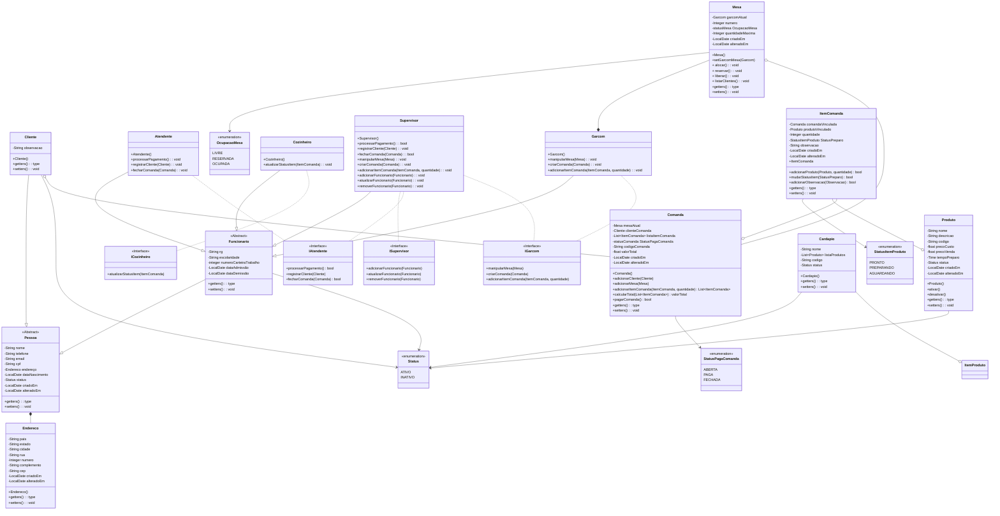

```mermaid
classDiagram
	class Pessoa{
		<<Abstract>>
		-String nome
		-String telefone
		-String email
		-String cpf
		-Endereco endereço
		-LocalDate dataNascimento
		-Status status
		-LocalDate criadoEm
		-LocalDate alteradoEm
		+getters() : type
        +setters() : void
	}
	Pessoa *-- Endereco
	Funcionario --|> Pessoa
	class Cliente {
        -String observacao
        +Cliente()
        +getters() : type
        +setters() : void
    }
    Cliente --|> Pessoa
    Cliente --> Status
    class Funcionario{
	    <<Abstract>>
        -String rg
        -String escolaridade
        -integer numeroCarteiraTrabalho
        -LocalDate dataAdmissão
        -LocalDate dataDemissão
        +getters() : type
        +setters() : void
    }
    Funcionario --> Status
    class Atendente{
	    +Atendente()
	    +processarPagamento() : void
		+registrarCliente(Cliente) : void
		+fecharComanda(Comanda) : void
    }
    Atendente --|> Funcionario
    Atendente .. IAtendente
    class Garcom{
	    +Garcom()
	    +manipularMesa(Mesa) : void
		+criarComanda(Comanda) : void
		+adicionarItemComanda(ItemComanda, quantidade) : void
    }
    Garcom --|> Funcionario
    Garcom .. IGarcom
    class Cozinheiro{
	    +Cozinheiro()
	    +atualizarStatusItem(ItemComanda) : void
    }
    Cozinheiro --|> Funcionario
    Cozinheiro .. ICozinheiro
    class Supervisor{
	    +Supervisor()
	    +processarPagamento() : bool
		+registrarCliente(Cliente) : void
		+fecharComanda(Comanda) : bool
		+manipularMesa(Mesa) : void
		+criarComanda(Comanda) : void
		+adicionarItemComanda(ItemComanda, quantidade) : void
		+adicionarFuncionario(Funcionario) : void
		+atualizarFuncionario(Funcionario) : void
		+removerFuncionario(Funcionario) : void
    }
    Supervisor --|> Funcionario
    Supervisor .. ISupervisor
    Supervisor .. IAtendente
    Supervisor .. IGarcom
    class Endereco {
        -String pais
        -String estado
        -String cidade
        -String rua
        -Integer numero
        -String complemento
        -String cep
        -LocalDate criadoEm
		-LocalDate alteradoEm
		+Endereco() 
		+getters() : type
		+setters() : void
    }
    class Mesa {
        -Garcom garcomAtual
        -Integer numero
        -statusMesa OcupacaoMesa
        -Integer quantidadeMaxima
        -LocalDate criadoEm
		-LocalDate alteradoEm
		+Mesa()
        +setGarcomMesa(Garcom)
        + alocar(): void
		+ reservar(): void
		+ liberar(): void
		+ listarClientes(): void
		+getters() : type
		+setters() : void
    }
    Mesa --> OcupacaoMesa
    Mesa --* Garcom
    class Comanda {
        -Mesa mesaAtual
        -Cliente clienteComanda
        -List~ItemComanda~ listaItemComanda
        -statusComanda StatusPagaComanda
        -String codigoComanda
        -float valorTotal
        -LocalDate criadoEm
		-LocalDate alteradoEm
		+Comanda()
        +adicionarCliente(Cliente)
        +adicionarMesa(Mesa)
        +adicionarItemComanda(ItemComanda, quantidade) List~ItemComanda~
        +calcularTotal(List~ItemComanda~) valorTotal
        +pagarComanda() bool
		+getters() : type
		+setters() : void
    }
    Comanda --> StatusPagaComanda
    Mesa o-- Comanda
    Cliente o-- Comanda
    class Produto {
        -String nome
        -String descricao
        -String codigo
        -float precoCusto
        -float precoVenda
        -Time tempoPreparo
        -Status status
        -LocalDate criadoEm
		-LocalDate alteradoEm
		+Produto()
        +ativar()
        +desativar()
		+getters() : type
		+setters() : void
    }
    Produto --> Status
    class ItemComanda {
        -Comanda comandaVinculada
        -Produto produtoVinculado
        -Integer quantidade
        -StatusItemProduto StatusPreparo
        -String observacao
        -LocalDate criadoEm
		-LocalDate alteradoEm
		+ItemComanda
        +adicionarProduto(Produto, quantidade) bool
        +mudarStatusItem(StatusPreparo) bool
        +adicionarObservacao(Observacao) bool
		+getters() : type
		+setters() : void
    }
    ItemComanda --> StatusItemProduto
    ItemComanda --o Produto
    ItemComanda --o Comanda
    class Cardapio {
        -String nome
        -List~Produto~ listaProdutos
        -String codigo
        -Status status
        +Cardapio()
		+getters() : type
		+setters() : void
    }
    Cardapio --> Status
	Cardapio --o ItemProduto    
    class IAtendente {
	    <<Interface>>
        +processarPagamento() bool
        +registrarCliente(Cliente)
        +fecharComanda(Comanda) bool
    }
    class IGarcom {
	    <<Interface>>
        +manipularMesa(Mesa)
        +criarComanda(Comanda)
        +adicionarItemComanda(ItemComanda, quantidade)
    }
    class ICozinheiro {
	    <<Interface>>
        +atualizarStatusItem(ItemComanda)
    }
    class ISupervisor {
	    <<Interface>>
        +adicionarFuncionario(Funcionario)
        +atualizarFuncionario(Funcionario)
        +removerFuncionario(Funcionario)
    }
	class Status{
	    <<enumeration>>
	    ATIVO
	    INATIVO
	}
	class OcupacaoMesa{
	    <<enumeration>>
	    LIVRE
	    RESERVADA
	    OCUPADA
	}
	class StatusItemProduto{
	    <<enumeration>>
	    PRONTO
	    PREPARANDO
	    AGUARDANDO
	}
	class StatusPagaComanda{
	    <<enumeration>>
	    ABERTA
	    PAGA
	    FECHADA
	}
```
